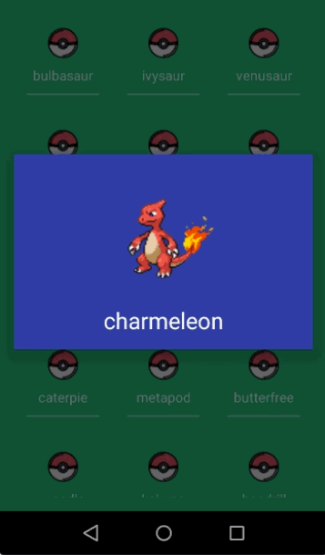

# PokeDex

Repository corresponding to the test 4.

> What is PokeDex?

This application shows users a sprite or photo about a selected 'pokemon'.

> What can you do in this application?

* Select a specific pokemon to see your photo or 'sprite'.

> What are the additional features?

* Use a RecyclerView to display the data.
* Use of [Retrofit2](https://square.github.io/retrofit/) and [Gson](https://github.com/square/retrofit/tree/master/retrofit-converters/gson) to consume and analyze data from the REST API of [PokeAPI](https://pokeapi.co/).

## Preview

## License

* [PokeAPI](https://pokeapi.co/)
* [Apache 2.0](http://www.apache.org/licenses/LICENSE-2.0.html)
* [Maven](https://maven.apache.org/)

## Authors

* **Yerko Pailemilla Parada** - *Developer* - [yerkopailemilla](https://github.com/yerkopailemilla)

## Learnings achieved

* [Retrofit2](https://square.github.io/retrofit/)
* [RecyclerView](https://developer.android.com/guide/topics/ui/controls/spinner)
